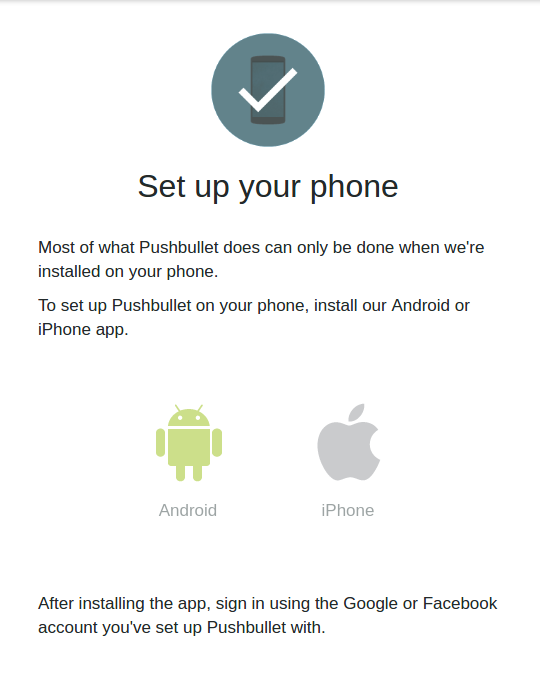
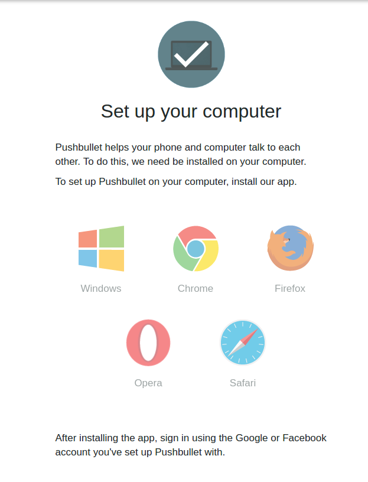
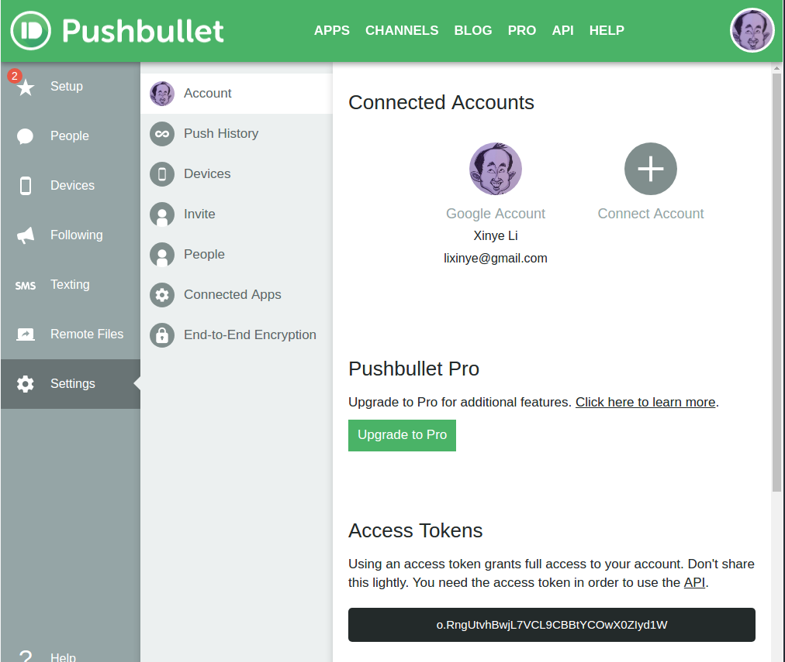
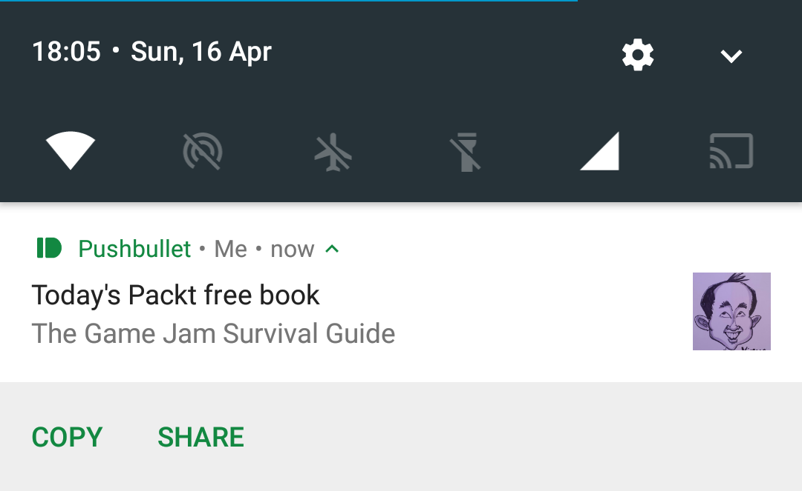

The very active development of R means that there are fewer and fewer tasks that cannot be accomplished with R. Today let's schedule a custom push notification for the smartphone.

# Why

There are two motivations:

1. There are websites that offer free stuff everyday. I have been taking the advantage of some free books but freqently find myself missing some that I would be quite interested simply because I forget to check the website (there are probably more socially acceptable ways like following them on twitter, but what's the fun in that?). I therefore want to have a daily notification on the phone that shows the book title, from which I will decide if I would like to go to the website and claim it.
2. At work I may be required to implement R script automation, this makes a perfect practice case.

# The plan

Here are the three simple steps:

1. We will be using R to scrape the book title off the webpage, which luckily for us has a static URL - for this, we use [rvest](https://github.com/hadley/rvest).
2. We then find a way to push the book title to the phone - for this, we use the popular web service [Pushbullet](https://www.pushbullet.com/), and yes, there's a package for that: [RPushbullet](https://github.com/eddelbuettel/rpushbullet) that interface .
3. The whole process can then be scheduled to run everyday from a server - we'll run a [`cron`](https://en.wikipedia.org/wiki/Cron) job on AWS.

# The walkthrough

## Scraping the book title

Out of caution I contacted the website for which I intend to use this method, as its Terms and Conditions don't specify the knowledge sharing of web scraping on the site. Until I have explicit permission from them I will stick to a non-specific example for now.

Hadley Wickham's `rvest` package is the [Beautiful Soup](https://www.crummy.com/software/BeautifulSoup/) for R, the *go to* package for web scraping. There are plenty of tutorials on the web, so I shall simply lay down the snippet here for completeness:

```{r scraping, eval=FALSE}
pacman::p_load(rvest, stringr)

url <- 'url.of.the/target/website'
selector <- '#CSS > selector > for > the > element'
book_title <- url %>%
  read_html %>%
  html_node(selector) %>%
  html_text %>%
  str_trim
```

## Push notifications

There is a few options to send information from the computer to the phone, including emailing packages such as [sendemailR](https://cran.r-project.org/web/packages/sendmailR/index.html), [gmailr](https://github.com/jimhester/gmailr) and [notifyR](https://cran.r-project.org/web/packages/notifyR/index.html). The first two focus on automated reporting using email, and they could be problematic when it comes to security settings such as two-step authentication; notifyR though seems like a great solution that is very easy to set up and works very well, however it uses the [Pushover](https://pushover.net/), and the mobile app is not free after seven days of trial, at the same time offers very limited functionality beyond pushing notifications.

The best solution is naturally Pushbullet. It is a well established web service that can push notifications between the smartphone and the computer among other functions (e.g. sending SMS messages via the computer). We are interested in pushing the book title to the phone, and this can be implemented using the [RPushbullet package](https://github.com/eddelbuettel/rpushbullet) by the briliant [Dirk Eddelbuettel](http://dirk.eddelbuettel.com/) who is better known for [Rcpp](https://github.com/RcppCore/Rcpp) among other open source contributions.

Setting up Pushbullet is straightforward, you can do that by logging in on the website using either the Google or Facebook credentials. Then download the app to set up on the phone:



And download the browser extension to set up on the computer:



And the last thing to do on the website is to go to the [account page](https://www.pushbullet.com/#settings/account) and grab an Access Token after clicking on the "Create Access Token" button:



The `RPushbullet` package uses a JSON file `~/.rpushbullet.json` configuration file to get the account information. The account is identify by the Access Token from the website account page, and the connected devices come with Token. The below code automates the process.

```{r rpushbullet_setup, eval=FALSE}
library(RPushbullet)
pbSetup(apikey = 'your_access_token')
```

When asked `Select a default device (0 for none): `, select the phone as the default device, as this will simplify a step later.

Now we can test pushing a notification:

```{r rpushbullet_send, eval=FALSE}
pbPost("link", title="Today's free book",
       url = url, body = book_title) 
```

There's the notification that you made yourself, it's a whole new world!



It is easy to imagine how useful this is for running script on a remote server, e.g. if a script takes longer than you care to keep checking whether it has finished, it's an elegant to be notified - just add the snippet at the end of the script. In fact that's the majority of the use cases I see, definitely worth a try.

## Scheduling

Now it's time to automate the notification, afterall there's no point sitting there everyday and pushing the button to run the R code, is there?

### Server

First of all we need to have a constantly running server. There are plenty of commercial cloud hosting services, the most ubiquitous being the Amazon Web Services EC2, and it is particularly attractive because of the 'free tier' we can use for this project. The caveat is that it's only free for 12 months. After that you can either spin up another EC2 free tier instance to set up in the same way, or migrate to a Raspberry Pi (at around £30 per slice it's about the same price as the cheapest EC2 "[t2.nano](https://aws.amazon.com/ec2/pricing/reserved-instances/pricing/)" instance for a year, but you can keep the former as long as you shall live).

For our project we'll choose AWS, as it allows you to start straight away. [Here](http://ipub.com/aws/) is a very good tutorial to help you set up your R environment on AWS EC2.

### Scheduler

With all Liux systems comes with a utility called `cron`. It is driven by a `crontab` (cron table) file, a configuration file that specifies shell commands to run periodically on a given schedule. To edit this file, run:

```{bash, eval=FALSE}
$ crontab -e
```

Each line of a crontab file represents a job, and looks like this:

```
 ┌──────── minute (0 - 59)
 │ ┌──────── hour (0 - 23)
 │ │ ┌──────── day of month (1 - 31)
 │ │ │ ┌──────── month (1 - 12)
 │ │ │ │ ┌──────── day of week (0 - 6) (Sunday to Saturday;
 │ │ │ │ │                                   7 is also Sunday)
 * * * * *  command to execute
```
 
The syntax of each line expects a cron expression made of five fields, followed by a shell command to execute.

_While normally the job is executed when the time/date specification fields all match the current time and date, there is one exception: if both "day of month" (field 3) and "day of week" (field 5) are restricted (not `*`), then one or both must match the current day.^[The time is based on the system [time zone](https://en.wikipedia.org/wiki/Cron#Timezone_handling)]_

For example:

```{bash, eval=FALSE}
# Clears the Apache error log at one minute past midnight (00:01) every day
1 0 * * *  printf > /var/log/apache/error_log

# Runs a shell program called export_dump.sh at 23:45 (11:45 PM) every Saturday
45 23 * * 6 /home/oracle/scripts/export_dump.sh
```

For our project, we need to run the R code everyday at, say, 9am, so here is the datetime part:

```{bash, eval=FALSE}
# Run at 9:00 AM on any day of the month, any month and any day of the week
0 9 * * *
```

Now let's work out the command to run.

The easest way to run an R script in the command line interface (CLI) is using the command `Rscript`, e.g.

```{bash, eval=FALSE}
$ Rscript script.R
```

Alternatively if the R script is executable then it can be called directly:

```{bash, eval=FALSE}
$ chmod +x script.R   # make the script executable
$ ./script.R          # the ./ part is necessary
```

The latter is a more streamline approach, as the command is simply the file name, although the file needs to be referenced by the full directory (e.g. `/home/ubuntu/projects/script.R`, assumg the script is saved under `projects` folder, and `ubuntu` is the default username on the AWS free tier Ubuntu instance). Therefore the `crontab` should be:

```{bash, eval=FALSE}
0 9 * * * /home/ubuntu/projects/script.R
```

The last thing to note is that using the executable script requires specifying the *interpreter directive* (a.k.a. *shebang*) at the top of the script `#!/usr/bin/env Rscript`, this tells the CLI which interpreter to use for the script.^[http://stackoverflow.com/a/18306656]

# Everything together

Now let's put everything together:

1. Create an R script called script.R:  
```{r, eval=FALSE}
#!/usr/bin/env Rscript
pacman::p_load(rvest, stringr, RPushbullet)

url <- 'url.of.the/target/website'
selector <- '#CSS > selector > for > the > element'
book_title <- url %>%
  read_html %>%
  html_node(selector) %>%
  html_text %>%
  str_trim

pbPost("link", title="Today's free book",
       url = url, body = book_title) 
```  
Save the script in `/projects` folder under the home directory (`~`).

2. Make the script executable:  
```{bash, eval=FALSE}
$ cd ~/projects
$ chmod +x script.R
```

3. Create a cron job by running `crontab -e`, and at the bottom of the file insert the line:   
```{bash, eval=FALSE}
0 9 * * * /home/ubuntu/projects/script.R
```

Now enjoy the custom notifications that contribute to your well organised life!
